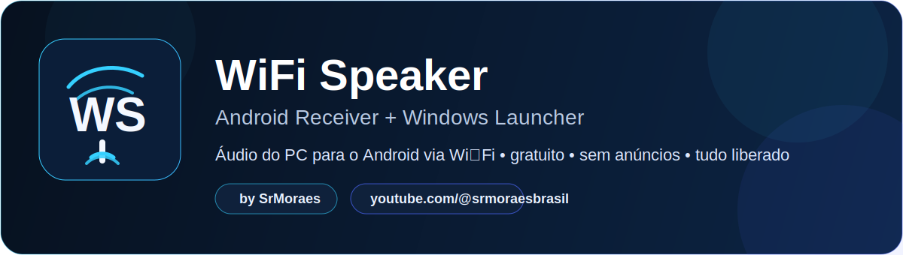
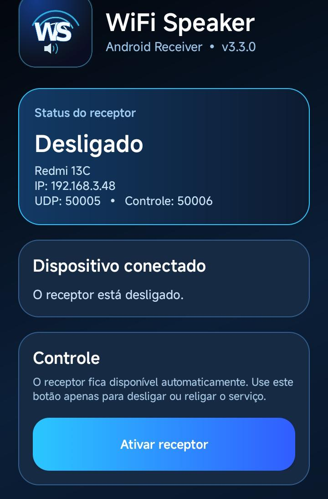
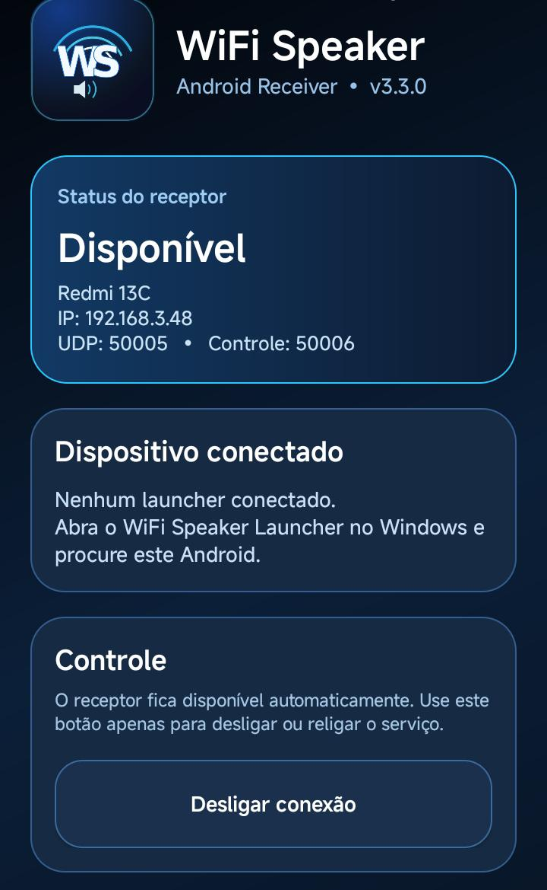
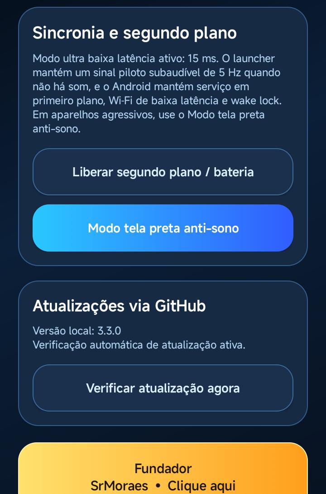

<p align="center">
  
</p>

<p align="center">
  
  
  
  
</p>

<p align="center">
  <strong>Transforme seu Android em uma caixa de som Wi‑Fi para o seu PC ou notebook.</strong><br>
  Projeto gratuito, sem anúncios e com todos os recursos liberados, criado por <strong>SrMoraes</strong>.
</p>

---

## 📌 O que é o WiFi Speaker?

O **WiFi Speaker** é um projeto composto por duas partes:

- **Android Receiver** → app instalado no celular, que recebe o áudio.
- **Windows Launcher** → launcher portable no PC/Notebook, que localiza o Android e envia o áudio pela rede Wi‑Fi.

A proposta é simples: você instala o app no Android, abre o launcher no Windows e passa a usar o **celular como saída de áudio do computador**, com foco em:

- baixa latência,
- praticidade,
- uso gratuito,
- visual moderno,
- funcionamento em segundo plano.

---

<p align="center">
  
</p>

<table>
  <tr>
    <td width="72" align="center"></td>
    <td>
      <strong>Launcher Portable para Windows</strong><br>
      Não precisa de instalador tradicional. Basta abrir o launcher, localizar o Android e iniciar a transmissão.
    </td>
  </tr>
  <tr>
    <td width="72" align="center"></td>
    <td>
      <strong>Android Receiver com visual profissional</strong><br>
      O app mostra o status do receptor, IP local, portas de áudio/controle e o dispositivo conectado em tempo real.
    </td>
  </tr>
  <tr>
    <td width="72" align="center"></td>
    <td>
      <strong>Ultra baixa latência</strong><br>
      Perfil de <strong>15 ms</strong> para uso mais rápido, com modos alternativos de maior estabilidade quando necessário.
    </td>
  </tr>
  <tr>
    <td width="72" align="center"></td>
    <td>
      <strong>Atualizações via GitHub</strong><br>
      O app consulta a versão remota, alerta quando houver nova versão e pode exigir atualização quando definido no <code>version.json</code>.
    </td>
  </tr>
  <tr>
    <td width="72" align="center"></td>
    <td>
      <strong>Recursos extras de proteção e continuidade</strong><br>
      Serviço em primeiro plano no Android, liberação de bateria/segundo plano, modo tela preta anti-sono, sinal piloto 5 Hz anti-sono e controles de inicialização/tray no Windows.
    </td>
  </tr>
</table>

---

## ✅ Recursos atuais

### No Android

- Interface moderna e limpa
- Status do receptor em tempo real
- Exibição do nome do dispositivo, IP, porta UDP e porta de controle
- Botão para ativar/desligar o receptor
- Área de status do dispositivo conectado
- Liberação rápida de permissões de segundo plano / bateria
- **Modo tela preta anti-sono**
- Verificação manual de atualização
- Botão de créditos/fundador

### No Windows Launcher

- Interface dark moderna
- Busca de receptores Android na rede local
- Adição manual de IP
- Conectar / desconectar do Android
- Seleção de dispositivo de saída de áudio
- Perfis de sincronização e estabilidade
- Volume ajustável
- Log de sessão em tempo real
- Início automático da transmissão
- Suporte a modo bandeja
- Configurações salvas em **%AppData%/WS**
- Opção de iniciar com o Windows

---

<p align="center">
  
</p>

## 📲 Instalação no Android

1. Baixe o APK da versão mais recente em:
   - **Releases:** <a href="https://github.com/srmoraesbrasil/WS-WiFi-Speaker/releases/latest">Clique aqui</a>
2. Instale o APK no seu celular Android.
3. Abra o app **WiFi Speaker**.
4. Toque em **Ativar receptor**.
5. Se desejar mais estabilidade em alguns aparelhos, toque em:
   - **Liberar segundo plano / bateria**
   - **Modo tela preta anti-sono**

> **Importante:** em muitos celulares Android, permitir segundo plano / remover restrição de bateria ajuda a evitar que o sistema pause a recepção com a tela desligada.

## 💻 Instalação no Windows

1. Baixe a versão mais recente do launcher em:
   - **Releases:** <a href="https://github.com/srmoraesbrasil/WS-WiFi-Speaker/releases/latest">Clique aqui</a>
2. Extraia a pasta do launcher.
3. Abra o executável do **WiFi Speaker Launcher**.
4. Aguarde a busca automática de receptores Android.
5. Se o Android não aparecer, informe o IP manualmente.

## 🔗 Como conectar

1. Certifique-se de que o **PC e o Android estejam na mesma rede Wi‑Fi**.
2. No Android, deixe o receptor **ativado**.
3. No Windows Launcher, clique em **Procurar dispositivos**.
4. Selecione o Android encontrado.
5. Clique em **Conectar**.
6. Escolha a saída de áudio desejada.
7. Clique em **Iniciar transmissão**.

---

## ⚙️ Perfis de sincronização

No launcher, você pode escolher entre diferentes modos:

- **Jogo / FPS • 15 ms + piloto 5Hz** → menor atraso possível
- **Vídeo / menor atraso • 45 ms** → bom equilíbrio para vídeos
- **Alta estabilidade • 90 ms** → melhor quando a rede estiver instável

> Se a sua rede Wi‑Fi estiver oscilando, use um modo de maior estabilidade.

---

## 🧠 Como o sistema anti-sono funciona

Para reduzir pausas causadas pelo Android:

- o app usa serviço em primeiro plano,
- oferece liberação de segundo plano / bateria,
- pode manter o aparelho acordado com o **modo tela preta anti-sono**,
- e o launcher pode enviar um **sinal piloto de 5 Hz** quando não há áudio, ajudando a manter o fluxo ativo.

---

<p align="center">
  
</p>

## 🖼️ Guia visual do Android

<table>
  <tr>
    <td align="center">
      <br>
      <strong>1. Receptor desligado</strong><br>
      Abra o app e ative o receptor.
    </td>
    <td align="center">
      <br>
      <strong>2. Receptor disponível</strong><br>
      Agora o Windows já pode localizar o aparelho.
    </td>
    <td align="center">
      <br>
      <strong>3. Segundo plano e atualizações</strong><br>
      Ajuste bateria/segundo plano e verifique a versão quando quiser.
    </td>
  </tr>
</table>

---

<p align="center">
  
</p>

## 🔄 Como funcionam as atualizações

O projeto usa um arquivo remoto chamado **version.json** para controlar:

- versão atual,
- versão mínima suportada,
- chave de versão,
- atualização obrigatória,
- modo manutenção,
- link de download.

Quando houver uma nova versão:

- o app pode apenas avisar,
- ou bloquear o uso até atualizar, dependendo da configuração do repositório.

### Arquivo usado

```json
{
  "current_version": "3.3.0",
  "min_supported_version": "3.3.0",
  "force_update": false,
  "maintenance_mode": false,
  "download_url": "https://github.com/srmoraesbrasil/WS-WiFi-Speaker/releases/latest"
}
```

---

## 📁 Estrutura recomendada do repositório

```text
WS-WiFi-Speaker/
├─ README.md
├─ version.json
├─ docs/
│  ├─ assets/
│  │  ├─ hero.svg
│  │  ├─ section-features.svg
│  │  ├─ section-install.svg
│  │  ├─ section-gallery.svg
│  │  ├─ section-update.svg
│  │  ├─ icon-windows.svg
│  │  ├─ icon-android.svg
│  │  ├─ icon-latency.svg
│  │  ├─ icon-update.svg
│  │  └─ icon-security.svg
│  └─ images/
│     ├─ android-status-desligado.jpg
│     ├─ android-status-disponivel.jpg
│     └─ android-background-update.jpg
```

---

## ❓ Dúvidas rápidas

### O projeto é pago?
Não. Esta versão é **gratuita**, **sem anúncios** e com **tudo liberado**.

### Precisa internet?
Não para transmitir localmente. O áudio vai pela sua rede Wi‑Fi local. A internet é necessária apenas para verificar atualizações no GitHub.

### Funciona com qualquer Android?
Funciona em muitos aparelhos, mas alguns fabricantes aplicam restrições agressivas de bateria/segundo plano. Nesses casos, use as opções do próprio app para minimizar interrupções.

### O launcher instala no Windows?
A proposta atual é **portable**, facilitando testar e usar rapidamente.

---

## 👤 Fundador

<p align="center">
  <strong>SrMoraes</strong><br>
  Canal oficial: <a href="https://www.youtube.com/@srmoraesbrasil">@srmoraesbrasil</a>
</p>

---

## ⭐ Apoie o projeto

Se este projeto foi útil para você:

- deixe uma estrela no repositório,
- acompanhe as atualizações,
- compartilhe com outras pessoas,
- e siga o canal do fundador.

<p align="center">
  <a href="https://github.com/srmoraesbrasil/WS-WiFi-Speaker">🌟 Ver repositório</a> • 
  <a href="https://github.com/srmoraesbrasil/WS-WiFi-Speaker/releases/latest">⬇️ Baixar última versão</a> • 
  <a href="https://www.youtube.com/@srmoraesbrasil">▶️ Canal do SrMoraes</a>
</p>
