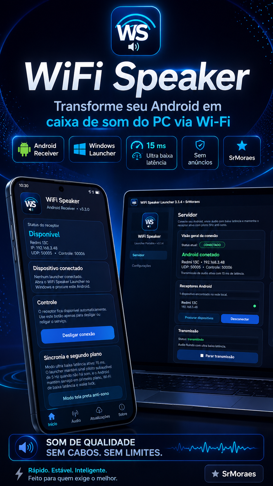
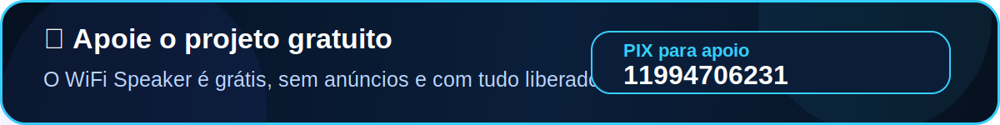
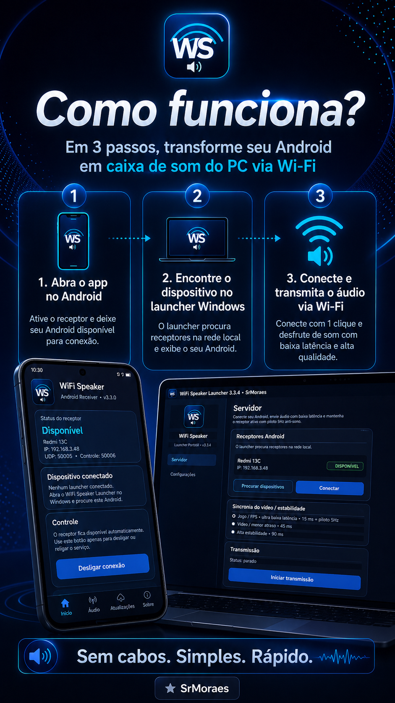
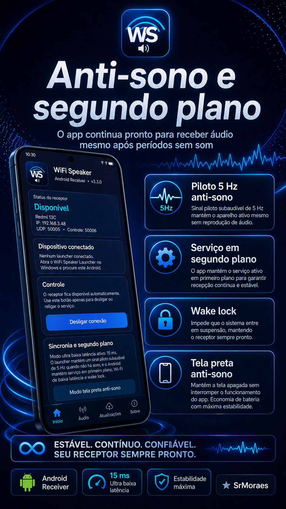
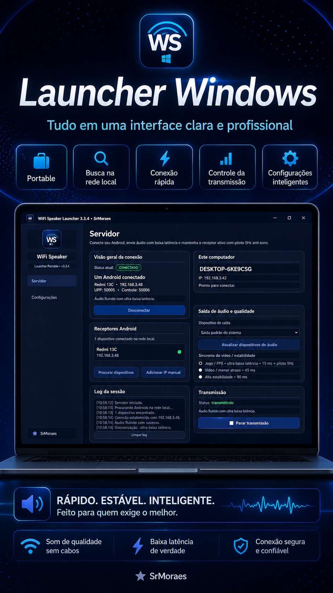
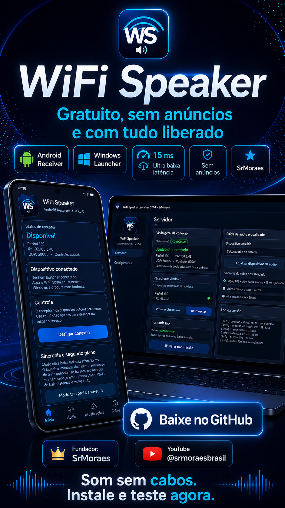

<p align="center">
  
</p>

<p align="center">
  
  
  
  
</p>

<p align="center">
  <strong>WiFi Speaker Launcher</strong><br>
  Transforme seu Android em uma caixa de som Wi‑Fi para o seu PC ou notebook.<br>
  Projeto gratuito, sem anúncios e com tudo liberado, criado por <strong>SrMoraes</strong>.
</p>

<p align="center">
  <a href="https://github.com/srmoraesbrasil/WS-WiFi-Speaker/releases/latest"><strong>⬇️ Baixar última versão</strong></a>
  ·
  <a href="https://www.youtube.com/@srmoraesbrasil"><strong>▶️ Canal SrMoraes</strong></a>
</p>

<p align="center">
  
</p>

---

## 🎧 O que é o WiFi Speaker?

O **WiFi Speaker** é um sistema com duas partes:

<table>
  <tr>
    <td width="50%">
      <h3>📱 Android Receiver</h3>
      <p>App instalado no celular Android. Ele fica disponível na rede local, recebe o áudio do PC e reproduz no aparelho.</p>
    </td>
    <td width="50%">
      <h3>💻 Windows Launcher</h3>
      <p>Launcher portable para Windows. Ele encontra o Android, conecta e envia o áudio do computador via Wi‑Fi.</p>
    </td>
  </tr>
</table>

A ideia é simples: **usar seu celular como uma caixa de som sem fio do PC**, sem mensalidade, sem anúncios e com foco em baixa latência.

---

<p align="center">
  
</p>

## ✨ Recursos principais

<table>
  <tr>
    <td><strong>⚡ Ultra baixa latência</strong></td>
    <td>Modo Jogo/FPS com foco em resposta rápida e sincronismo entre imagem e som.</td>
  </tr>
  <tr>
    <td><strong>📶 Transmissão Wi‑Fi local</strong></td>
    <td>O áudio trafega pela sua rede local, sem depender de cabo USB para reprodução.</td>
  </tr>
  <tr>
    <td><strong>💤 Anti-sono inteligente</strong></td>
    <td>Sistema com piloto 5 Hz, serviço em segundo plano, wake lock e modo tela preta anti-sono.</td>
  </tr>
  <tr>
    <td><strong>🖥️ Launcher profissional</strong></td>
    <td>Interface dark, busca na rede local, conexão rápida, controle da transmissão e configurações.</td>
  </tr>
  <tr>
    <td><strong>🔄 Atualizações via GitHub</strong></td>
    <td>Consulta de versão remota por <code>version.json</code>, com aviso de atualização e suporte a atualização obrigatória.</td>
  </tr>
  <tr>
    <td><strong>🎁 Gratuito</strong></td>
    <td>Sem anúncios, sem bloqueio de função e feito para todos.</td>
  </tr>
</table>

---

<p align="center">
  
</p>

<p align="center">
  
</p>

## ⚡ Como usar em 3 passos

1. **Abra o app no Android**  
   Ative o receptor e deixe o celular conectado na mesma rede Wi‑Fi do PC.

2. **Abra o launcher no Windows**  
   Clique em **Procurar dispositivos** ou adicione o IP manualmente.

3. **Conecte e transmita**  
   Selecione o Android, clique em **Conectar** e depois em **Iniciar transmissão**.

---

<p align="center">
  
</p>

## 📥 Download e instalação

### 📱 Android

1. Acesse a página de releases:
   - <a href="https://github.com/srmoraesbrasil/WS-WiFi-Speaker/releases/latest">github.com/srmoraesbrasil/WS-WiFi-Speaker/releases/latest</a>
2. Baixe o arquivo **APK**.
3. Instale no Android.
4. Abra o app **WiFi Speaker**.
5. Toque em **Ativar receptor**.

### 💻 Windows

1. Acesse a página de releases.
2. Baixe o pacote **WiFiSpeakerLauncher-Portable.zip**.
3. Extraia a pasta.
4. Abra o **WiFiSpeakerLauncher.exe**.
5. Procure o Android e inicie a transmissão.

> O PC e o Android precisam estar na **mesma rede Wi‑Fi**.

---

## 🎮 Ultra baixa latência

<p align="center">
  
</p>

O modo de menor atraso foi pensado para:

- vídeos,
- músicas,
- jogos,
- testes rápidos,
- uso diário sem cabos.

Perfis disponíveis no launcher:

| Modo | Indicação |
|---|---|
| **Jogo / FPS • 15 ms** | menor atraso possível |
| **Vídeo / menor atraso • 45 ms** | bom equilíbrio para vídeos |
| **Alta estabilidade • 90 ms** | melhor para redes instáveis |

---

## 💤 Anti-sono e segundo plano

<p align="center">
  
</p>

O Android pode pausar apps em segundo plano por economia de bateria. Por isso, o WiFi Speaker inclui recursos para manter o receptor ativo:

- **piloto 5 Hz anti-sono**,
- **serviço em segundo plano**,
- **wake lock**,
- **Wi‑Fi lock**,
- **modo tela preta anti-sono**,
- botão para **liberar segundo plano / bateria**.

Em alguns celulares, principalmente modelos com economia agressiva, também é recomendado marcar o app como **Sem restrições / Irrestrito** nas configurações de bateria.

---

## 🖥️ Launcher Windows

<p align="center">
  
</p>

O launcher do Windows foi pensado para ser direto e visual:

- busca automática na rede local,
- conexão rápida,
- seleção de dispositivo de saída,
- controle de transmissão,
- configurações salvas em `%APPDATA%\WS`,
- opção de iniciar com o Windows,
- opção de minimizar para bandeja,
- log de sessão.

---

<p align="center">
  
</p>

## 🎬 Imagens para Shorts, Reels e vídeos

Estas imagens estão dentro da pasta `docs/images` e podem ser usadas para divulgação do projeto:

<table>
  <tr>
    <td align="center"><br><strong>Abertura</strong></td>
    <td align="center"><br><strong>Como funciona</strong></td>
    <td align="center"><br><strong>15 ms</strong></td>
  </tr>
  <tr>
    <td align="center"><br><strong>Anti-sono</strong></td>
    <td align="center"><br><strong>Launcher</strong></td>
    <td align="center"><br><strong>Chamada final</strong></td>
  </tr>
</table>

---

## 🔄 Atualizações via GitHub

O sistema usa o arquivo `version.json` para controlar atualização do Windows Launcher e do Android Receiver.

Exemplo de informações usadas:

```json
{
  "current_version": "3.3.5",
  "min_supported_version": "3.3.5",
  "force_update": false,
  "maintenance_mode": false,
  "download_url": "https://github.com/srmoraesbrasil/WS-WiFi-Speaker/releases/latest"
}
```

Com isso, o app pode:

- avisar sobre nova versão,
- bloquear versões antigas quando necessário,
- abrir a página de download,
- exibir manutenção temporária.

---

<p align="center">
  
</p>

## 🛠️ Solução de problemas

### O Android não aparece no launcher

- Confirme que PC e Android estão na mesma rede Wi‑Fi.
- Ative o receptor no app Android.
- Clique em **Procurar dispositivos**.
- Use o IP manual se a busca automática não encontrar.

### A transmissão conecta, mas não toca áudio

- Verifique se a saída de áudio correta foi selecionada.
- Clique em **Atualizar dispositivos de áudio**.
- Teste a saída padrão do sistema.
- Gere o launcher novamente se estiver usando uma versão antiga.

### O áudio para quando a tela apaga

- Use o botão **Liberar segundo plano / bateria**.
- Marque o app como **Sem restrições / Irrestrito**.
- Use o **Modo tela preta anti-sono** em aparelhos mais agressivos.

### Está com atraso

- Use o modo **Jogo / FPS • 15 ms**.
- Aproxime o Android e o PC do roteador.
- Evite redes Wi‑Fi congestionadas.

---

## 📁 Estrutura recomendada

```text
WS-WiFi-Speaker/
├─ README.md
├─ version.json
├─ docs/
│  ├─ assets/
│  │  ├─ pix-banner.svg
│  │  ├─ section-download.svg
│  │  ├─ section-features.svg
│  │  ├─ section-gallery.svg
│  │  ├─ section-how.svg
│  │  └─ section-faq.svg
│  └─ images/
│     ├─ 01-hero-wifi-speaker.png
│     ├─ 02-como-funciona.png
│     ├─ 03-ultra-baixa-latencia.png
│     ├─ 04-anti-sono-segundo-plano.png
│     ├─ 05-launcher-windows.png
│     └─ 06-baixe-no-github.png
```

---

## 👑 Fundador

<p align="center">
  <strong>SrMoraes</strong><br>
  Canal oficial: <a href="https://www.youtube.com/@srmoraesbrasil">@srmoraesbrasil</a><br>
  Pix para apoiar o projeto: <strong>11994706231</strong>
</p>

<p align="center">
  
</p>

<p align="center">
  <a href="https://github.com/srmoraesbrasil/WS-WiFi-Speaker/releases/latest"><strong>⬇️ Baixar no GitHub</strong></a>
  ·
  <a href="https://www.youtube.com/@srmoraesbrasil"><strong>▶️ YouTube</strong></a>
</p>

---

<p align="center">
  <strong>Som sem cabos. Simples. Rápido.</strong><br>
  Feito por SrMoraes para quem exige o melhor.
</p>
